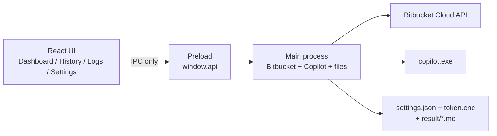

# Architecture and evaluation

Internal desktop app: fetch Bitbucket Cloud pull requests, send the PR diff to GitHub Copilot CLI, save the review locally, and optionally post comments on the PR.

Setup: [SETUP.md](SETUP.md).

## Layers

Classic Electron split. The UI never holds the token and never calls Bitbucket or Copilot directly.

| Path | Role |
| --- | --- |
| `src/` | Renderer only. Zustand for UI state. No token, no network. |
| `electron/preload/` | Narrow bridge: `getSettings`, `reviewPullRequest`, and similar. |
| `electron/main/` | Real work: settings, secrets, Bitbucket, Copilot, review, logs, history. |
| `prompts/` and `assets/` | Review instruction text. |
| `result/` | Review output on this machine. |

Main-process files:

- `index.ts` — window and IPC
- `settings.ts` — settings on disk (token not stored here)
- `secrets.ts` — token encrypted with Windows DPAPI via Electron `safeStorage`
- `bitbucket.ts` — list PRs, fetch diff, post comments
- `copilot.ts` — run CLI and parse JSON
- `review.ts` — full review flow
- `review-status.ts` — persisted PR review status
- `history.ts` / `logger.ts` — history and logs

After save, the renderer only sees `hasToken: true`. It never gets the token back.

## Review flow

1. **Settings** — Bitbucket URL, project, repository, token, prompt file, results directory, write mode (`local` or `bitbucket`). Repo page URL is `{origin}/projects/{project}/repos/{repository}`.
2. **Dashboard → Refresh** — `GET .../pullrequests`. Needs **Pull requests: Read**. Optional **Auto refresh** (minutes) and **Auto-review new PRs** (only PRs that appear after the current list is known).
3. **Review** — fetch the **diff** (Bitbucket requires **Repositories: Read**), write the prompt to a temp file, run `copilot` with a short `-p` that reads that file (`-s --no-ask-user`).
4. Write `result/<repo>/PR-<id>-<timestamp>.md` and `.json`.
5. If write mode is Bitbucket, post comments. If Local, stop at the files.

Listing PRs and reading the diff are **different Bitbucket scopes**. Connection check now calls both the PR list and the repository endpoint, so **Connected** means the token can list PRs and read the repo (needed for diffs). Existing tokens cannot gain scopes; create a new token and paste it in Settings.

Required token scopes:

- **Repositories: Read** — fetch the PR diff
- **Pull requests: Read** — list PRs
- **Pull requests: Write** — only if posting comments

Settings shows this checklist. After Save, a missing-scope error is shown in the UI, not only in Logs.

## Evaluation

**What works well**

- Security split is correct: `contextIsolation`, `sandbox`, token not in JSON.
- Small surface, easy to maintain, English UI.
- 200KB diff limit after ignore filters (lockfiles, images, build output). Logs redact secrets.
- Copilot is resolved from PATH or `%LOCALAPPDATA%\GitHub CLI\copilot\copilot.exe`.
- Output stays in the chosen results directory.
- Review status (`reviewed` / `failed`) is stored in `userData/review-status.json`, keyed by project/repo/PR. It survives restart. A new source commit resets the PR to not reviewed. Known PR ids in the same file power auto-review of newly opened PRs.
- Copilot prompt is written to a temp directory (not passed as a huge `-p` argument), then deleted.
- Windows installer: `npm run dist` writes NSIS setup and a portable exe to `release/`.

**Gaps**

- One repository configured at a time (no repo switcher).
- No automated tests.
- One global `busy` flag; reviews are not queued in parallel.

**Summary**

Fit for internal use on one machine, not a platform. Structure is sound: dumb UI, main process does the work, secrets stay out of the renderer. Bitbucket token scopes remain the main setup requirement; the UI now names them before review fails.
